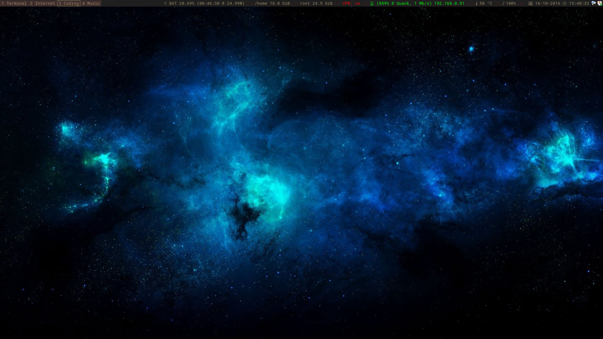
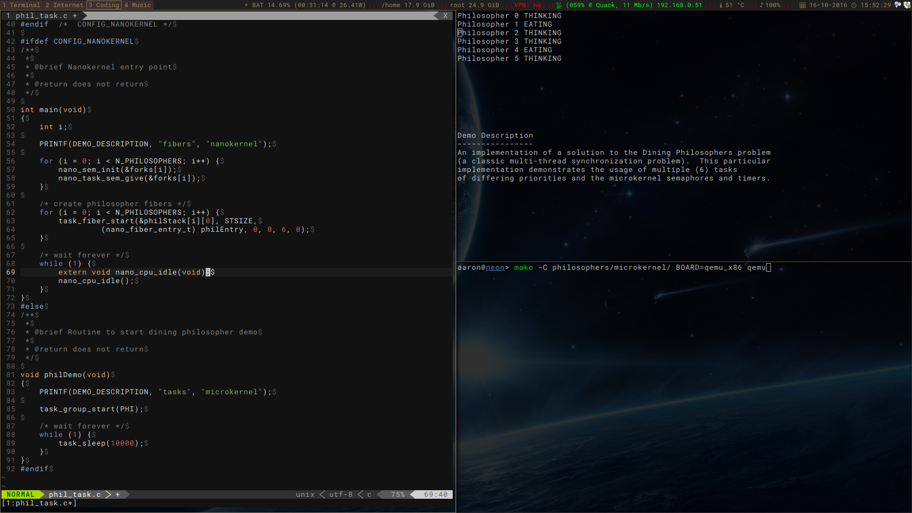

# LinuxDotFiles
Personal Linux configuration files for 

- i3wm
- vim
- tmux
- urxvt
- zsh

# Dependencies

You'll need the following software for a fully functional setup.

- i3-wm
- i3status
- i3lock
- dmenu
- zsh
- vim
- rxvt-unicode
- tmux
- feh
- volnoti (AUR, GitHub)
- jauth-git (AUR, GitHub)

# Screenshots

